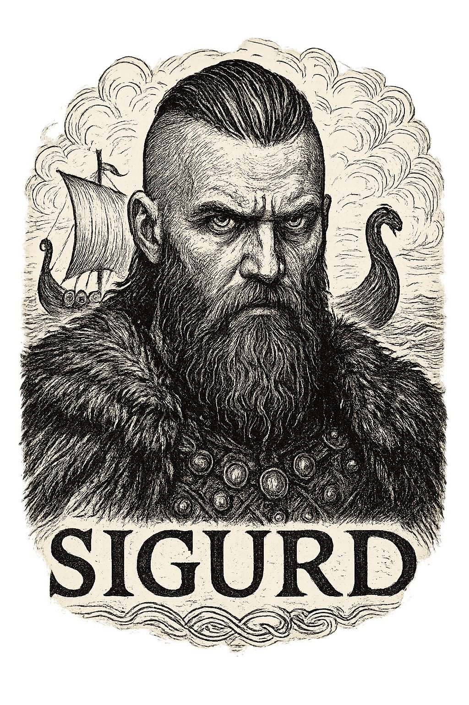

  

---

  
  
  
  
  
  

> [!IMPORTANT]
> This repository intentionally contains only this README. The actual Sigurd sample is not published here. Sigurd is a research/forensics artifact with capabilities that could be harmful if misused. Access is restricted and provided only to vetted researchers, instructors, incident responders, and authorized learners under formal agreements.

## [👤] About Sigurd

Sigurd is a research-oriented malware sample, specifically a Remote Access Trojan (RAT), used to support digital forensics, incident response training, and CTF-style forensic challenges. It appeared in the ITSEC Asia Cyber Security SUMMIT CTF event. The first known sample of Sigurd was submitted to <a href="https://www.virustotal.com/gui/file/a8ed9231b4128d5aa006daa27034e30f0c2c59ca4b1211b33da63e142e504f91/detection" target="_blank">VirusTotal</a> by CTF participants, which may be relevant to analysts studying its behavior.

## [📃] High-level (Non-Actionable) Summary

For defensive analysts and instructors, the artifact demonstrates patterns commonly seen in threats and red-team tooling, including (descriptive only):

- Discord-based command-and-control style communications.
- Remote command execution capability guarded by an authorization check.
- A file transformation/encryption pipeline that marks modified files.
- Clipboard capture and remote exfiltration of clipboard contents.
- Keystroke capture (keylogger) with local and remote logging.
- Windows persistence via Registry-key modification.
- Cleanup routines and multiple stealth measures.

> [!TIP]
> This list is intentionally high-level and non-actionable — it does not provide build/run instructions, configuration values, or operational guidance.

## [❓] Who may Request Access

Access is intended for legitimate defenders and educators: university instructors running isolated labs, DFIR teams performing analysis, security researchers validating detections, and CTF/competition organizers who need controlled challenge artifacts. Requests from individuals or groups without a verifiable institutional affiliation will be subject to stricter vetting or denied.

## [✅] DFIR Lab Offer

Approved recipients will get a secure, logged transfer of materials tailored to their needs. Typical deliverables include:

- An encrypted sample archive (delivered only after vetting and signed agreements).
- A DFIR lab package (VM snapshot or disk image) that contains the artifact in a contained environment suitable for hands-on analysis.
- A sanitized forensic guide and IOCs to support teaching and detection work.

## [📰] Provenance

- Used in: ITSEC CTF Competition 2025 (forensics final round).
- Public trace: The first version of Sigurd was submitted to VirusTotal by CTF participants.

## [🧪] Development & Future

Sigurd is an active research artifact and may be enhanced over time for defensive research and teaching. Distribution policy and access controls will remain governed by the maintainers

## [📧] How to Request Access

E-mail `baycysec@gmail.com` with:
- Full name, affiliation, and role.
- Intended use (training / research / CTF).
- Short containment plan (VM provider or snapshot/rollback).

After initial review for 2 weeks, we’ll provide details about agreements and secure transfer.

## [📝] Developer
- [jon-brandy](https://github.com/jon-brandy)
